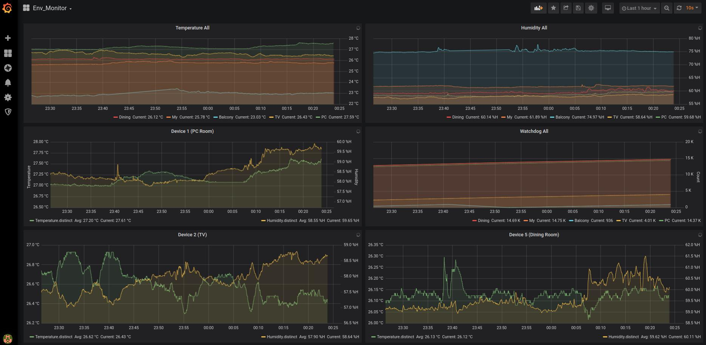
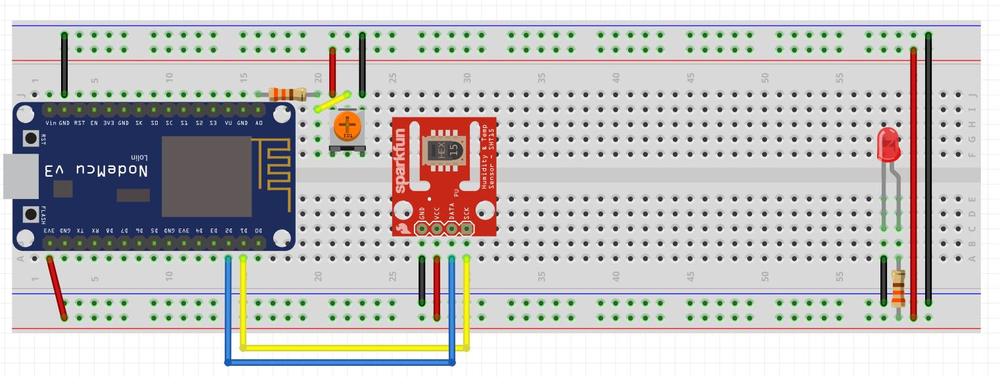
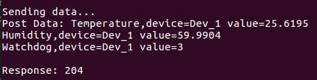

# Environment Monitor
Collecting sensors data for NodeMCU platform display on Grafana.

#

# Prerequisites
* [pipenv](https://github.com/pypa/pipenv)
* [InfluxDB](https://docs.influxdata.com/influxdb/v1.7/introduction/installation/)
* [Grafana](https://grafana.com/docs/grafana/latest/installation/debian/)

# Circuit
* NodeMCU *1
* SHT20 *1
* Resistor 330Ω *2
* LED *1
* Couple wires
#

# Install
Install tools for NodeMCU from Pipfile:
- `pipenv install`

# How to start
Make sure InfluxDB and Grafana service is already running. and
there is a database in InfluxDB. Edit `/env_monitor/config.json`.
`STA_SSID`, `STA_PASSWORD` is for which wifi device NodeMCU connect to.
`AP_SSID`, `AP_PASSWORD` is for debug remotely.

1. Setting device id by turing potentiometer.
2. Upload code to NodeMCU: `./run_all.sh`.
3. Connect to NodeMCU through USB for debug: `./connect_device.sh`.

    If everything goes well, you will see some information like below.
    #

4. Open Grafana webpage and import `/grafana/Env_Monitor.json`. 
    Or you can design your own dashboard.
5. Cheers \m/
 

# Troubleshooting
1. If InfluxDB and Grafana set on different server
    - Set admin and password: `CREATE USER admin WITH PASSWORD 'password'`

    Edit InfluxDB configuration file
    - Linux: /etc/influxdb/influxdb.conf
    - macOS: /usr/local/etc/influxdb.conf
    ```
    [http]
      enabled = true
      bind-address = ":8086"
      auth-enabled = true
      log-enabled = true
      write-tracing = false
      pprof-enabled = true
      pprof-auth-enabled = true
      debug-pprof-enabled = false
      ping-auth-enabled = true
    ```
    - Update configuration: `sudo /usr/bin/influxd -config /etc/influxdb/influxdb.conf`

2. If there is something goes wrong on uploading code. 
    - Edit `code_rest.sh` use `--flash_size=detect 0` command.  


